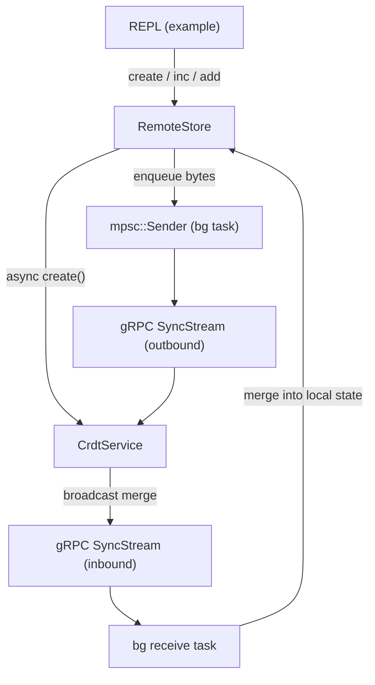

# CRDT Project Refactor

## Goal

The target is a `RemoteStore` public API so that a client example only writes a REPL and calls store methods — no gRPC imports, no channels, no `bincode`, no HLC, no `Arc<Mutex<...>>`.

```rust
// The entire client example boils down to:
let mut store = RemoteStore::new();
let _ = store.connect("http://[::1]:50051").await;

// REPL loop...
store.create("counter1", CrdtKind::GCounter).await?;
store.gcounter_inc("counter1", 1)?;
println!("{}", store.gcounter_value("counter1").unwrap());

store.lwwset_add("myset", "hello")?;
println!("{:?}", store.lwwset_members("myset").unwrap());
```

## Proposed File Layout

```
src/
├── lib.rs
├── crdt/
│   ├── mod.rs           Crdt trait + pub enum CrdtKind
│   ├── enums.rs         AnyCrdt, AnyCrdtRef, AnyReplica  (internal, not pub-re-exported)
│   ├── g_counter.rs     (unchanged)
│   └── lww_set.rs       (unchanged)
├── pb.rs                single shared tonic::include_proto!
├── server/
│   └── mod.rs           CrdtService + InternalSyncResponse + tonic impl
└── client/
    └── mod.rs           RemoteStore (pub), StoreError (pub), connection helpers (private)

examples/
├── crdt_server.rs       main() only
└── crdt_client.rs       CrdtKind, REPL commands, main() — all using RemoteStore
```

## Key Design Decisions

### `RemoteStore` API (`src/client/mod.rs`)

All fields are private. The store can be created offline and connected later, matching the current REPL behavior.

```rust
pub struct RemoteStore { /* private */ }

pub enum StoreError { NotFound, TypeMismatch, NotConnected, Rpc(tonic::Status) }

impl RemoteStore {
    pub fn new() -> Self
    pub async fn connect(&mut self, addr: &str) -> Result<(), tonic::transport::Error>
    pub fn disconnect(&mut self)
    pub fn is_connected(&self) -> bool

    // Creates variable locally + registers on server (unary RPC) if connected
    pub async fn create(&mut self, name: &str, kind: CrdtKind) -> Result<(), StoreError>

    // Lists all local variable names and their kinds
    pub fn list(&self) -> Vec<(String, CrdtKind)>

    // GCounter
    pub fn gcounter_inc(&mut self, name: &str, delta: u64) -> Result<(), StoreError>
    pub fn gcounter_value(&self, name: &str) -> Option<u64>

    // LWW-Set
    pub fn lwwset_add(&mut self, name: &str, element: String) -> Result<(), StoreError>
    pub fn lwwset_remove(&mut self, name: &str, element: String) -> Result<(), StoreError>
    pub fn lwwset_members(&self, name: &str) -> Option<HashSet<String>>
}
```

Mutation methods (`gcounter_inc`, `lwwset_add`, etc.) are **synchronous** — they update local state and fire-and-forget enqueue a serialized update to the background send task via an `mpsc::Sender`.

`connect` spawns the background receive task (the current `handle_connection`) as a private function inside the module.

### `CrdtKind` (`src/crdt/mod.rs`)

```rust
pub enum CrdtKind { GCounter, LWWSet }
```

Replaces the `CrdtType` enum that currently lives in the client example and the `clap::ValueEnum` derive stays in the example (since it's CLI-specific).

### Internal types (`src/crdt/enums.rs`)

`AnyCrdt`, `AnyCrdtRef`, `AnyReplica` move here (consolidating the three duplicate definitions). They are `pub(crate)` — not part of the public API, only used inside `client/mod.rs` and `server/mod.rs`.

### `src/pb.rs`

```rust
tonic::include_proto!("crdt.v1");
```

Both examples and both `server/` and `client/` modules use `crate::pb` (or `crdt::pb`).

### `src/server/mod.rs`

Moves `CrdtService`, `InternalSyncResponse`, `SyncStreamResponseStream`, and the `tonic::async_trait` impl out of `examples/crdt_server.rs`. Server example reduces to:

```rust
use crdt::server::CrdtService;
#[tokio::main]
async fn main() -> Result<(), Box<dyn Error>> {
    CrdtService::serve("[::1]:50051").await
}
```

### `examples/crdt_client.rs`

The REPL commands that map CLI tokens to `RemoteStore` calls stay here — they are pure CLI concern. The example imports only:

```rust
use crdt::client::{RemoteStore, StoreError};
use crdt::crdt::CrdtKind;
```

## Data Flow



## Feature Flag Alignment

- `server` feature gates `src/server/mod.rs`
- `client` feature gates `src/client/mod.rs`
- Add `[[example]]` entries in `Cargo.toml`:

```toml
[[example]]
name = "crdt_server"
required-features = ["server"]

[[example]]
name = "crdt_client"
required-features = ["client"]
```

## Summary of Changes

- `src/crdt/mod.rs` — add `pub enum CrdtKind`
- `src/crdt/enums.rs` — add `AnyCrdtRef`, `AnyReplica` as `pub(crate)`
- `src/pb.rs` — new, single proto include
- `src/server/mod.rs` — replace stub with `CrdtService` + `serve()` helper
- `src/client/mod.rs` — replace stub with `RemoteStore`, `StoreError`, private connection helpers
- `src/lib.rs` — add `pub mod pb`; re-export `RemoteStore`, `StoreError`, `CrdtKind`
- `examples/crdt_server.rs` — reduce to `main()` calling `CrdtService::serve()`
- `examples/crdt_client.rs` — rewrite REPL to use `RemoteStore` methods
- `Cargo.toml` — add `[[example]]` sections
